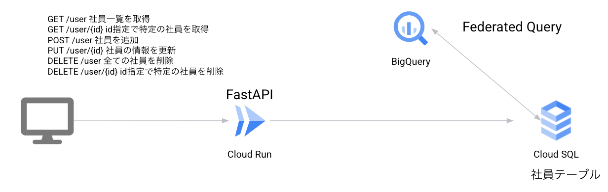
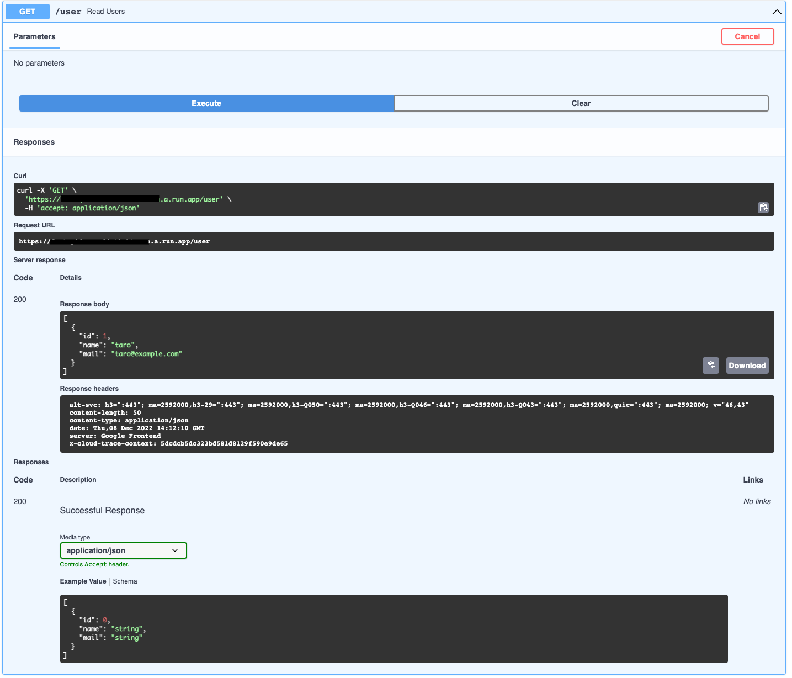
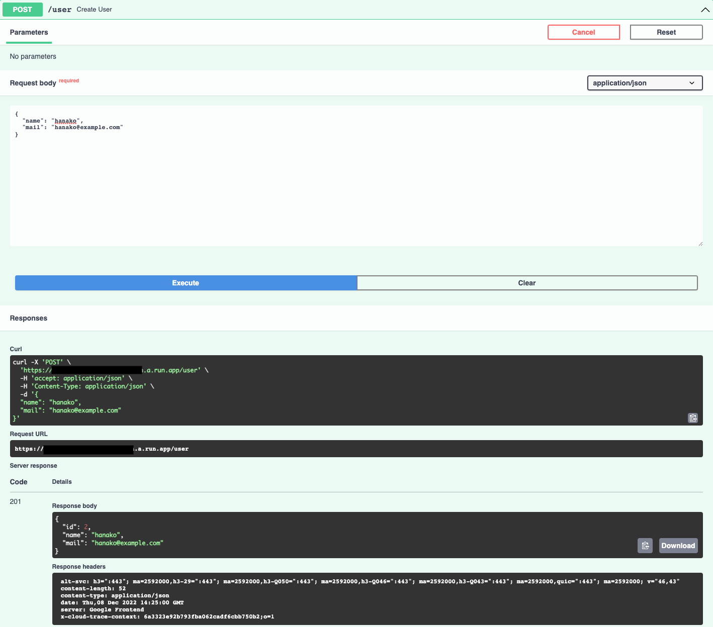
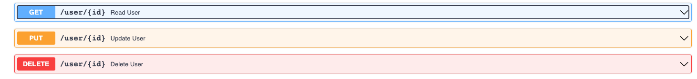

# Handson
## CloudshellにPoetryをインストール
今回のハンズオンではPoetryを使用します  
以下のコマンドを実行してPoetryをCloudshellにインストールします。
```sh
curl -sSL https://install.python-poetry.org | python -
```

```sh
source $HOME/.poetry/env
```

依存関係をcloudshellにインストールします。
```sh
poetry install
```

## Google Cloud プロジェクトの選択

ハンズオンを行う Google Cloud プロジェクトを作成し、 そのプロジェクトを選択して **Start/開始** をクリックしてください。

**今回のハンズオンで作成したリソースをハンズオンの終了後に一括で削除できるよう、新しいプロジェクトを作成することを推奨します。**

<walkthrough-project-setup>
</walkthrough-project-setup>

<!-- Step 1 -->
## はじめに

### 内容と目的
本ハンズオンは、CRUD機能を持ったコンテナをCloud Runにデプロイし、APIサーバーを作成します。Cloud RunとCloud SQLを接続して、データをCloud SQLに格納します。  
Cloud SQLに格納されたデータをBigQueryのFederated Queryを使ってクエリできることを確認します。

### 対象プロダクト
以下が今回学ぶ対象のプロタクトの一覧です。
- Cloud Run
- Cloud SQL
- BigQuery
- Artifact Registry

### アーキテクチャ
社員を管理するテーブルを操作するためのAPIをCloud Run上で動かします。
IDを指定することで個別に操作を行うことができます。


<!-- Step 2 -->
## ハンズオンの内容

下記の内容をハンズオン形式で学習します。

### **学習ステップ**
- 環境準備
  - gcloud コマンドラインツール設定
  - Google Cloud 機能（API）有効化
  - Service Account(SA) への権限の付与
- Cloud SQLの作成
- Artifact Registryの作成
- Cloud Runを用いたアプリケーションのデプロイ
- APIを触ってみる
- スケールアウトの確認
  - 負荷試験ツールを用いた Cloud Run のスケールアウト性能の確認
- BigQueryからCloud SQLのデータをクエリする

- クリーンアップ
  - Cloud Runの削除
  - Cloud SQLの削除
  - BigQueryの外部接続の削除
  - Artifact Registryの削除

<!-- Step 3 -->
## 環境準備
最初に、ハンズオンを進めるための環境準備を行います。

下記の設定を進めていきます。

- gcloud コマンドラインツール設定
- Google Cloud 機能（API）有効化
- Service Account(SA) への権限の付与

<!-- Step 4 -->
## gcloud コマンドラインツール

Google Cloud は、CLI、GUI、REST API から操作が可能です。ハンズオンでは主に CLI を使い作業を行います。


### gcloud コマンドラインツールとは?

gcloud コマンドライン インターフェースは、Google Cloud でメインとなる CLI ツールです。このツールを使用すると、コマンドラインから、またはスクリプトや他の自動化により、多くのプラットフォーム関連のタスクを実行できます。

たとえば、gcloud CLI を使用して、以下のようなものを作成、管理できます。

- Google Compute Engine 仮想マシン
- Google Kubernetes Engine クラスタ
- Google Cloud SQL インスタンス

**ヒント**: gcloud コマンドラインツールについての詳細は[こちら](https://cloud.google.com/sdk/gcloud?hl=ja)をご参照ください。

<!-- Step 5 -->
## gcloud コマンドラインツール設定

gcloud コマンドでは操作の対象とするプロジェクトの設定が必要です。

### Google Cloud のプロジェクト ID とプロジェクト番号を環境変数に設定

環境変数 `PROJECT_ID` に Google Cloud プロジェクト ID を設定します。
また、環境変数 `GOOGLE_CLOUD_PROJECT_NUMBER` にプロジェクト番号を設定します。

プロジェクト番号は、[ダッシュボード](https://console.cloud.google.com/home?_ga=2.238919744.1366576378.1649220788-814150504.1631697149)の画面を参照してください。12桁の数字です。
[サンプル](https://cloud.google.com/resource-manager/img/project_id.png)  
以下のコマンドを入力すると環境変数にプロジェクトIDとプロジェクト番号を設定することができます。

```sh
export PROJECT_ID=$(gcloud config get-value project)
export GOOGLE_CLOUD_PROJECT_NUMBER=$(gcloud projects describe $PROJECT_ID --format='value(projectNumber)')
```

以下のコマンドを実行してプロジェクト名とプロジェクト番号がダッシュボードと同じであることを確認してください。
```sh
echo ${PROJECT_ID}
echo ${GOOGLE_CLOUD_PROJECT_NUMBER}
```

### CLI（gcloud コマンド） から利用する Google Cloud のデフォルトプロジェクトを設定

操作対象のプロジェクトを設定します。
権限を与えるための確認画面が出たら承認して進めます。

```sh
gcloud config set project $PROJECT_ID
```

<!-- Step 6 -->
## Google Cloud 環境設定 Part1

Google Cloud では利用したい機能ごとに、有効化を行う必要があります。
ここでは、以降のハンズオンで利用する機能を事前に有効化しておきます。


### ハンズオンで利用する Google Cloud の API を有効化する

以下の機能を有効にします。

- Cloud Run Admin API
- Artifact Registry API
- Cloud SQL API
- BigQuery API
- BigQuery Connection API

```sh
gcloud services enable \
  run.googleapis.com \
  artifactregistry.googleapis.com \
  bigquery.googleapis.com \
  sqladmin.googleapis.com \
  bigqueryconnection.googleapis.com
```

<!-- Step 7 -->
## Google Cloud 環境設定 Part2

### サービスアカウントへの権限付与

サービスアカウントとは、アプリケーションや VM インスタンスが使用するアカウントです。    
デフォルトでは、Cloud Run サービスまたはジョブは、デフォルトの Compute Engine サービス アカウントとして実行されます。  
今回のハンズオンでは、 Cloud RunはCloudSQLにアクセスする必要があるためデフォルトのサービスアカウントにCloud SQLの権限を付与します。  

 **今回のハンズオンではデフォルトのサービスアカウントに権限を付与していますが、実際の開発の現場では用途に応じて[きめ細かい権限を持つ独自のユーザー管理サービス アカウントを作成する](https://cloud.google.com/run/docs/securing/service-identity?hl=ja#about_the_default_service_account)ようにしましょう！**

```bash
gcloud projects add-iam-policy-binding ${PROJECT_ID} --member="serviceAccount:${GOOGLE_CLOUD_PROJECT_NUMBER}-compute@developer.gserviceaccount.com" --role='roles/cloudsql.client'
```

<!-- Step 8 -->
## 環境変数の設定
Cloud SQLのインスタンス名、データベース名、データベースユーザー名(root)、rootユーザーのパスワード、Artifact Registryのリポジトリ名、Cloud Runのサービス名、BigQueryの外部接続名を環境変数に設定します。

```sh
export INSTANCE_ID="handson-mysql"
export DATABASE_ID="handsondb"
export DB_USER_NAME="root"
export DB_USER_PASSWORD="pass"
export REPOSITORY_NAME="fastapi"
export CLOUDRUN="fastapidemo"
export CON_ID="mysql_con"
```

## Cloud SQLを作成する
MySQL for Cloud SQLを作成します。  
ハンズオンのためrootユーザーを使用していますが、実際に開発で使用する場合は適切な権限のユーザーを使用してください。  
今回のハンズオンではCloud SQLにパブリックIPを付与し、インターネット経由で接続します。
```sh
gcloud sql instances create ${INSTANCE_ID} \
    --database-version=MYSQL_8_0_26 --cpu=2 --memory=8GiB \
    --region=asia-northeast1 --root-password=${DB_USER_PASSWORD}
```

データベースを作成します。
```sh
gcloud sql databases create ${DATABASE_ID} \
--instance=${INSTANCE_ID}
```

CloudshellからCloud SQLに接続します(passwordは`pass`です)
```sh
gcloud sql connect ${INSTANCE_ID} --user=root
```

handsondbを使用します。
```sh
use handsondb
```

以下のクエリを実行してテーブルを作成します。
```sh
CREATE TABLE user ( \
id int auto_increment, \
name varchar(20) DEFAULT NULL, \
mail varchar(255) DEFAULT NULL, \
index(id));
```

テーブルにデータを追加します。
```sh
insert into user(name, mail) values('taro', 'taro@example.com');
```

追加したデータを確認します。
```sh
select * from user;
```

mysqlとの接続を切ります
```sh
exit
```
<!-- Step 9 -->
## Artifact Registryを作成する
Artifact Registryにハンズオン用のリポジトリを作成します。  
Artifact Registryでは作成したコンテナイメージを管理します。

```sh
gcloud artifacts repositories create ${REPOSITORY_NAME} \
--repository-format=docker --location=asia-northeast1
```
イメージを push または pull する前に、gcloud コマンドライン ツールを使用して Artifact Registry へのリクエストを認証するように Docker を構成します。
```sh
gcloud auth configure-docker asia-northeast1-docker.pkg.dev
```

<!-- Step 10 -->
## アプリケーションコードの確認
今回のハンズオンではFastAPIを利用します。  
ソースコードを確認してみましょう。  

Cloud Shell には Emacs, Nano, Vim が最初から入っているので、好みのエディタを使ってください。また Visual Studio Code に慣れている方は、
```sh
cloudshell edit .
```
とすると VS Code に似たエディタが開きます。  

`app`ディレクトリ以下の`main.py`を見るとGET・POST・PUT・DELETEのエンドポイントがあることがわかります。  


<!-- Step 11 -->
## コンテナイメージを作成
### コンテナイメージを作成する
次のコマンドでコンテナイメージを作成します。

```sh
docker build -t asia-northeast1-docker.pkg.dev/${PROJECT_ID}/${REPOSITORY_NAME}/${CLOUDRUN}:1.0 .
```

<!-- Step 12 -->
## コンテナ イメージをローカルでテストする
以下のコマンドを実行してローカルでテストします。
```sh
PORT=8080 && docker run -p 8080:${PORT} -e PORT=${PORT} asia-northeast1-docker.pkg.dev/${PROJECT_ID}/${REPOSITORY_NAME}/${CLOUDRUN}:1.0
```
エディタ画面の右上にあるアイコン <walkthrough-web-preview-icon></walkthrough-web-preview-icon> をクリックし、"ポート 8080 でプレビュー"を選択します。  
これによりブラウザで新しいタブが開き、Cloud Shell 上で起動しているコンテナにアクセスできます。  

`https://xxxxxx.cloudshell.dev/yyy`というURLで新しいタブが開くので、
URL末尾の`yyy`を`docs`に変更して`https://xxxxxx.cloudshell.dev/docs`にアクセスするとSwaggerUIにアクセスできます。

確認が終わったら、Cloud Shell 上で `Ctrl+C` を入力して実行中のアプリケーションを停止します。

ローカルでテストする方法は他にもあるため気になる方は確認してみてください。
[Cloud Run サービスをローカルでテストする](https://cloud.google.com/run/docs/testing/local?hl=ja#cloud-code-emulator)

## ローカルに作成したコンテナイメージをartifact registryにpushする
作成したコンテナイメージをArtifact Registryにpushします。
```sh
docker push asia-northeast1-docker.pkg.dev/${PROJECT_ID}/${REPOSITORY_NAME}/${CLOUDRUN}:1.0
```

## Cloud Runのデプロイ
以下のコマンドでArtifact Registryに登録されたコンテナイメージをCloud Runにデプロイします。

```sh
gcloud run deploy ${CLOUDRUN} \
--image asia-northeast1-docker.pkg.dev/${PROJECT_ID}/${REPOSITORY_NAME}/${CLOUDRUN}:1.0 \
--allow-unauthenticated \
--set-env-vars=PROJECT_ID=${PROJECT_ID},INSTANCE_ID=${INSTANCE_ID},DATABASE_ID=${DATABASE_ID},REPOSITORY_NAME=${REPOSITORY_NAME},DB_USER_PASSWORD=${DB_USER_PASSWORD},DB_USER_NAME=${DB_USER_NAME} \
--add-cloudsql-instances=${PROJECT_ID}:asia-northeast1:${INSTANCE_ID} \
--concurrency=10 \
--max-instances=5 \
--region=asia-northeast1
```
デプロイが完了するまで待ちます。正常に完了すると、デプロイされたサービスの URL が成功のメッセージと一緒に表示されます。

<!-- Step 13 -->
## 動作確認
デプロイしたアプリケーションにアクセスしてみましょう。
表示されたURLの末尾に`/docs`をつけて、`https://xxxxxx.a.run.app/docs`にアクセスするとSwaggerUIが開きます。

試しにエンドポイントにリクエストを送信してみましょう。 

### GETを試す
GETの「Try it out」->「Execute」を順にクリックすることで事前に登録したtaroのデータを見ることができます。


### POSTを試す
POSTも試してみましょう。POSTするデータはRequest body内で設定します。


もう一度GETを実行してhanakoが追加されていることを確認しましょう。

### 個別のユーザーに対して操作を行う
このAPIでは登録時に採番されるIDを指定することで個別のユーザーに対する操作を行うことができます。
IDの自動採番はCloud SQLのテーブル作成時にauto_incrementを指定することで実現しています。


IDが1であるtaroのデータをPUTで修正して、修正内容をGETで確認して、DELETEしてみましょう。
<!-- Step 14 -->
## サンプルデータを登録する
テスト時などダミーデータが大量に必要な場合があります。  
その場合、手動でダミーデータを生成するより機械的に生成した方が手間が少なくなります。

今回はPythonのFakerというライブラリを使って生成します。

環境変数にCloud RunのURLと作成するダミーデータの個数を設定します。
```sh
export URL=$(gcloud run services describe ${CLOUDRUN} --platform managed --region asia-northeast1 --format 'value(status.url)')
```


```sh
export POST_PATH="/user"
export URI="${URL}${POST_PATH}"
export N="10"
```

ローカルでcreate_dummy.pyを実行してダミーデータをAPIにリクエスト(POST)します。
```sh
poetry shell
```
```sh
python create_dummy.py ${N} ${URI}
```

<!-- Step 16 -->
## Cloud Runに負荷をかけてみる
負荷試験ツールを使い、デプロイしたアプリケーションが自動的にスケールアウトすることを確認します。

今回はLocustを使って負荷試験を行います。  
次のコマンド実行します。
```sh
locust -P 8080
```
Locust は Web UI を持つため、Cloud Shell のプレビュー機能を使い UI を表示します。
エディタ画面の右上にあるアイコン <walkthrough-web-preview-icon></walkthrough-web-preview-icon> をクリックし、"ポート 8080 でプレビュー"を選択します。

Locust の Web UI では、負荷試験の設定値を入力する画面が表示されるので、それぞれ入力します。

* `Number of users` - 同時に存在するユーザ数です。今回の Cloud Run の設定では、コンテナ数が最大 5、同時接続数が 10 なので、50を設定します。(50 より大きくすると接続できないユーザが出ます。)
* `Spawn rate` - 負荷試験ユーザが出現する頻度です。デフォルトの 1 (ユーザ/秒)でよいでしょう。
* `Host` - 接続先の URL を入力します。末尾のスラッシュは不要です。`https://xxxxxx.a.run.app`

<walkthrough-footnote>それでは負荷試験を実行してみましょう。</walkthrough-footnote>

<!-- Step 17 -->
## 負荷試験の実施

### 負荷試験の実行、メトリクスの確認

`Start swarming` ボタンを押し、負荷試験を始めます。
画面が切り替わるので、 `Statistics` タブでリクエストの種類別の結果を確認したり、`Charts` タブで時系列での変化を見ることができます。

### Cloud Run 側のメトリクスの確認

続いて、[Cloud Run のメトリクス](https://console.cloud.google.com/run/detail/asia-northeast1/fastapidemo/metrics?project={{project-id}})を開き、コンテナの数が負荷試験の実行に伴い増えていることを確認します。

デフォルトでは時間幅が 1 日になっているので、右上の時間幅を 1 時間を選択してください。

参考: スケールアウトの性能には、Cloud Run 自体の起動時間とその上で動くコンテナの起動時間の両方が効いてきます。コンテナの起動にかかった時間は `container/startup_latencies` というメトリクスで確認することが可能です。余力がある方は [Cloud Monitoring Metrics Explorer](https://console.cloud.google.com/monitoring/metrics-explorer?project={{project-id}}) にてこのメトリクスを確認してみてください。

### 負荷試験の停止

Locust の Web UI に戻り、右上の `STOP` ボタンを押して負荷試験を止めます。  
Cloud Shell 上で `Ctrl+C` を入力して実行中のLocustを停止します。

### アイドル状態のコンテナの確認

Cloud Run 側のメトリクスを見ると、 `Container instance count` に `Idle` のコンテナが残っていることがわかります。  
一方で、`Billable container instance time` を見ると、コンテナ数よりも早く 0 に落ちていて、リクエストを処理していないコンテナは課金されないことが確認できます。

**参考**: Cloud Run はデフォルトではレスポンスを返し終わると CPU の割り当てが制限され、課金されないようになっています。  
一方で、スレッドを立て、バックグラウンドで処理を継続したいこともあるかと思います。そのような場合は [CPU always allocated](https://cloud.google.com/run/docs/configuring/cpu-allocation) の設定を有効にすることで CPU を使った処理を継続することが可能です。

<!-- Step 18 -->

## BigQueryのFederated Queryを試してみる
BigQuery Cloud SQL 連携機能を使用すると、データのコピーや移動を行わずに、BigQuery から Cloud SQL に存在するデータのクエリをリアルタイムで実行できます。

### 接続の設定を行う
最初に 1 回だけ設定を行う必要がありますが、その後は SQL の関数 EXTERNAL_QUERY を使用してクエリを作成できます。  
以下のコマンドを実行して設定を行います。

```sh
bq mk --connection --display_name='friendly name' --connection_type='CLOUD_SQL' \
  --properties='{"instanceId":"'${PROJECT_ID}':asia-northeast1:'${INSTANCE_ID}'","database":"'${DATABASE_ID}'","type":"MYSQL"}'  \
  --connection_credential='{"username":"'${DB_USER_NAME}'", "password":"'${DB_USER_PASSWORD}'"}' \
  --project_id=${PROJECT_ID} --location=asia-northeast1 ${CON_ID}
```

## BigQueryからCloud SQLにクエリを実行する
Cloud SQLのテーブルをBigQueryからクエリできることがわかります。
```sh
bq query --use_legacy_sql=false 'select * from EXTERNAL_QUERY("projects/'"${PROJECT_ID}"'/locations/asia-northeast1/connections/'"${CON_ID}"'", "select * from user")'
```

**参考**
BigQueryのGUIから実行したい場合は以下のクエリを実行して、BigQueryのクエリエディタに貼り付けて実行します。[BigQueryのGUI](https://console.cloud.google.com/bigquery?hl=ja&_ga=2.195578917.846467741.1655176340-100005838.1655176340)   
```
select * from EXTERNAL_QUERY("projects/<project_id>/locations/asia-northeast1/connections/mysql_con", "select * from user")
```


## Congraturations!

<walkthrough-conclusion-trophy></walkthrough-conclusion-trophy>

これにて Cloud Run へのアプリケーションのデプロイ ハンズオンは完了です！！

デモで使った環境が不要な方は、次の手順でクリーンアップを行って下さい。

## クリーンアップ（リソースを削除）

作成したリソースを削除します。

Cloud Runの削除
```sh
gcloud run services delete ${CLOUDRUN}
```
BigQueryの外部接続の削除
```sh
bq rm --connection ${PROJECT_ID}.asia-northeast1.${CON_ID}
```
Artifact Registryの削除
```sh
gcloud artifacts repositories delete ${REPOSITORY_NAME} --location=asia-northeast1
```
Cloud SQLの削除
```sh
gcloud sql instances delete ${INSTANCE_ID}
```

